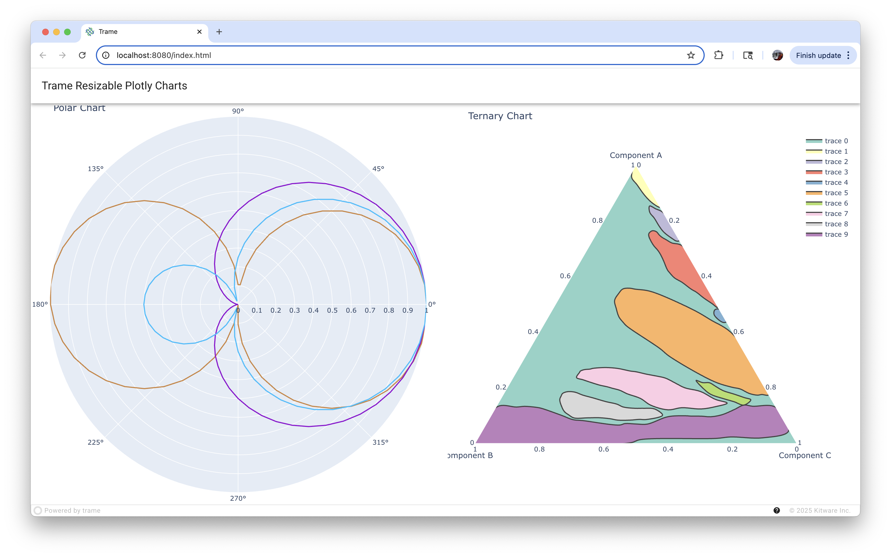

# Trame 3+ Examples with Vuetify 3 and Vue 3

This repository showcases modern Trame application development using Trame 3+, Vue 3, and Vuetify 3. The examples demonstrate best practices, including the use of the `@TrameApp()` decorator and an inheritance-based application structure.

## Migrating from Trame 2 / Vue 2 / Vuetify 2

Moving to the latest versions of Trame, Vue, and Vuetify offers significant improvements in performance, features, and developer experience. Here are some key considerations:

*   **Trame 3+**: Leverages the latest Python features and provides a more streamlined API.
*   **Vue 3**: Introduces the Composition API, improved performance, and better TypeScript support.
*   **Vuetify 3**: A complete rewrite for Vue 3, offering enhanced components and customization options. It's available via the `trame-vuetify` package.

### Modern Application Structure: `@TrameApp()` and Inheritance

A recommended approach for structuring Trame 3 applications is to use the `@TrameApp("AppName")` decorator on a class that inherits from `trame.app.TrameApp`. This pattern promotes modularity and organization.

```python
from trame.app import get_server, TrameApp
from trame.ui.vuetify import VAppLayout # Or other UI components

@TrameApp()
class MyApp(TrameApp):
    def __init__(self, server=None):
        super().__init__(server)
        # Initialize your state, controllers, and UI here
        self.ui = self._build_ui()

    def _build_ui(self):
        with VAppLayout(self.server) as layout:
            # Define your layout and components
            # ...
            return layout

if __name__ == "__main__":
    app = MyApp()
    app.server.start()
```

## Examples

Below are the examples included in this repository. Each example demonstrates specific features or use cases of Trame.

---

### Charts / Plotly Examples

#### 1. Plotly Charts Selector
*   **Script:** [`00_plotly-charts-selector.py`](./charts/plotly/00_plotly-charts-selector.py)
*   **Description:** This application demonstrates how to dynamically select and display different Plotly charts within a Trame application. It serves as a foundational example for integrating Plotly with Trame and showcases a responsive UI for chart selection.
*   **Image:**
    

---

#### 2. Resizable Plotly Charts
*   **Script:** [`01_plotly-charts-resizable.py`](./charts/plotly/01_plotly-charts-resizable.py)
*   **Description:** This example builds upon basic chart display by demonstrating how to make Plotly charts resizable within the Trame UI. It showcases handling layout changes and ensuring charts adapt to their container size.
*   **Image:**
    

---

### PyDeck Examples

#### 1. Mapping Demo
*   **Script:** [`00_mapping-demo.py`](./pydeck/00_mapping-demo.py)
*   **Description:** This application showcases the integration of Deck.gl with Trame for visualizing geospatial data. It demonstrates how to create interactive maps with multiple data layers (e.g., bike rentals, BART stops) using PyDeck and Mapbox, all within a modern Trame 3 / Vue 3 structure.
*   **Image:**
    

---

#### 2. Uber NYC Pickups Visualization
*   **Script:** [`01_uber-nyc-pickups.py`](./pydeck/01_uber-nyc-pickups.py)
*   **Description:** Visualizes Uber pickup data across New York City using Deck.gl for heatmap layers on multiple maps (Overall NYC, JFK, Newark, and LaGuardia airports). Features an Altair-based histogram displaying pickups per minute for a user-selected hour. Includes a slider to filter data by the hour of the day. Demonstrates reactive updates, a Vuetify 3 grid layout, and Mapbox API integration for base maps. Requires a `MAPBOX_API_KEY` environment variable for map rendering.
*   **Image:**
    

---

### Vuetify Examples

#### 1. DataFrame Table
*   **Script:** [`00_dataframe-table.py`](./vuetify/00_dataframe-table.py)
*   **Description:** This example demonstrates how to display a pandas DataFrame using the Vuetify 3 `VDataTable` component within a Trame 3 application. It showcases features like reactive search, sorting, selection, and dynamic grouping. The application is built using a modern class-based structure.
*   **Image:**
    

---

#### 2. Menu
*   **Script:** [`01_menu.py`](./vuetify/01_menu.py)
*   **Description:** This example demonstrates a simple Vuetify 3 `VMenu` component within a Trame 3 application. It shows how to create a menu with items that trigger a Python callback when clicked, all refactored into a modern class-based structure.
*   **Image:**
    

#### 2. Router
*   **Script:** [`02_router.py`](./vuetify/02_router.py)
*   **Description:** This application demonstrates multi-page navigation using `trame-router` with Vuetify 3 components in a Trame 3 application. It features a navigation drawer, dynamically generated routes, and showcases how to structure a multi-view application.
*   **Image:**
    

---

*More examples to come!*

## Running the Examples

1.  Ensure you have Python and pip installed.
2.  Create and activate a virtual environment:
    ```bash
    python -m venv venv
    source venv/bin/activate  # On Windows: venv\Scripts\activate
    ```
3.  Install the required dependencies using the `requirements.txt` file:
    ```bash
    pip install -r requirements.txt
    ```
4.  Run an example script:
    ```bash
    python charts/plotly/00_plotly-charts-selector.py
    ```
5.  Open your web browser and navigate to the URL provided in the console (usually `http://localhost:8080`).

