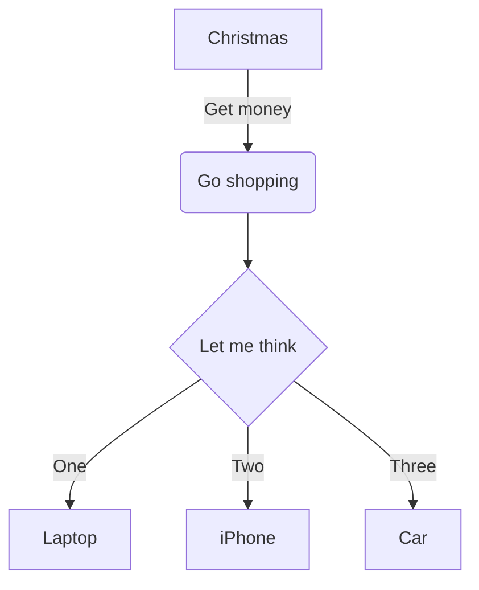

# markdown-it-vue

## Image size and Viewer


## GitHub Table of Contents

[toc]

Note: Only `h2` and `h3` are shown in toc.

## alter

Markup is similar to fenced code blocks. Valid container types are `tip`, `info`, `warning`, `danger` and `details`.

::: tip
You have got it.
:::

::: info
You have new mail.
:::

::: warning
You have new mail.
:::

::: danger
Staying up all night is bad for health.
:::

::: success
You have new mail.
:::

::: error
Staying up all night is bad for health.
:::

## Subscript: H~2~O

You can also use inline math: $H_2O$


## Superscript: 29^th^

You can also use inline math: $29^{th}$

## ASCIIMath

Inline ASCIIMath: ``(1/2[1-(1/2)^n])/(1-(1/2))=s_n``

```ASCIIMath
oint_Cx^3 dx+4y^2 dy

2=(((3-x)xx2)/(3-x))

sum_(m=1)^oosum_(n=1)^oo(m^2 n)/(3^m(m3^n+n3^m)
```

```ASCIIMath
phi_n(kappa) = 1/(4pi^2 kappa^2)
 int_0^oo (sin(kappa R))/(kappa R)
 del/(del R)
[R^2 (del D_n (R))/(del R)] del R
```

[AsciiMath Documentation](http://asciimath.org/)

## Emoji: :panda_face: :sparkles: :camel: :boom: :pig:

[Emoji Cheat Sheet](http://www.emoji-cheat-sheet.com/)

## Fontawesome: :fa fa-car: :fa-solid fa-flag: :fa-regular fa-flag: :fa fa-bicycle: :fa fa-leaf: :fa-solid fa-heart: :fa-regular fa-heart:

[All the Font Awesome icons](http://fontawesome.io/icons/)

## code

### c
```c
#include <stdio.h>
int main(int argc char* argv[]) {
  printf("Hello, World!");
  return 0;
}
```

### json

```json
{
  "name": "markdown-it-vue"
}
```

### javascript
```javascript
import MarkdownItVue from 'markdown-it-vue'
export default {
  components: {
    MarkdownItVue
  }
}
```

### bash
```bash
npm install markdown-it-vue
```

## table

| First Header  | Second Header |
| ------------- | ------------- |
| Content Cell  | Content Cell  |
| Content Cell  | Content Cell  |

## Mermaid Chart Test




```
sequenceDiagram
    participant Alice
    participant Bob
    Alice->John: Hello John, how are you?
    loop Healthcheck
        John->John: Fight against hypochondria
    end
    Note right of John: Rational thoughts <br/>prevail...
    John-->Alice: Great!
    John->Bob: How about you?
    Bob-->John: Jolly good!
```